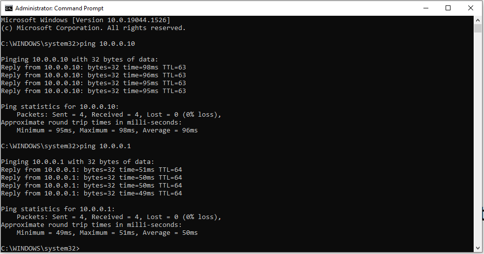
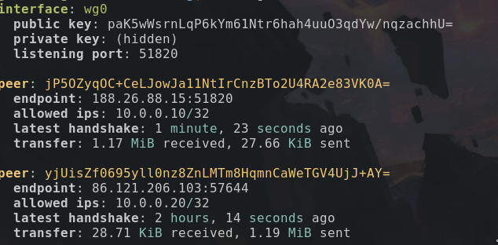

# Proiect VPN

Pentru proiectul cu VPN, am setat un server de [wireguard](https://www.wireguard.com/)
este un protocol de VPN mai simplu de setat.

Serverul de VPN este setat în cloud, are o adresă IP publică, ceea ce ne-a ajutat
să trecem peste problemele de conectivitate pe care le aveam cu NAT-ul, fară
a trebui să apelăm la o solutie de gen *port forwording*

## Setare VPN

### instalare

Pentru a instala și seta severul de VPN, wireguard în acest caz trebuie instalat
wireguard, pe serverul, de ubuntu in acest caz, se folosește o simplă comandă
`apt install wireguard`

### cheile de criptare

Este necesară crearea unei perechi de chei pentru criptarea pachetelor.
Wireguar vine cu o unealtă pentru generarea cheilor `wg genky`

Apoi cheia publică trebuie trimisă clientiilor ce vor sa se conecteze, aceștia
trebuind să trimită cheilor lor publice server-ului.

### fisierul de configurare

Exemplu de fisier al clinetului

```
[Interface]
Address = 10.0.0.10/24
PrivateKey = <cheie_privata>
ListenPort = 51820

[Peer]
PublicKey = paK5wWsrnLqP6kYm61Ntr6hah4uuO3qdYw/nqzachhU=
Endpoint =  138.68.178.177:51820
AllowedIPs = 10.0.0.0/24
PersistentKeepalive = 60
```

Se specifică adresa pe care o va avea clientul în rețeaua virtuală, cheia privată
folosită.
"Peer" reprezintă celălalt host, la care se va conecta clientul, adica serverul,
trebuie specificată cheia publică, precum și adresa IP a acestuia.
"AllowedIPS" reprezintă IP-rule ce vor fi rutate prin VPN. În cazul de fată nu se
ruteaza tot traficul prin VPN ci doar cel in rețeaua specificată.
"PersistenKeepalive" reprezintă intervalul de timp la care clientul va trimite
simple packete server-ului pentru a păstra o sesiune activă prin NAT.

Server:

```
[Interface]
PrivateKey = <cheia_privata>
ListenPort = 51820

[Peer]
# ubuntu
PublicKey = jP5OZyqOC+CeLJowJa11NtIrCnzBTo2U4RA2e83VK0A=
AllowedIPs = 10.0.0.10/32

[Peer]
# Bora
PublicKey = yjUisZf0695yll0nz8ZnLMTm8HqmnCaWeTGV4UjJ+AY=
AllowedIPs = 10.0.0.20/32
```

Fisierul de configurare al serverului este similar, diferența este ca acesta va
avea cate un camp "Peer" pentru fiecare client și nu necestă "Endpoint" pentru
aceștia.

Aici "AllowedIPs" reprezinta IP-urile ce pot fi folosite de clienți. Se pot specifica
mai multe adrese IP, dar acestea nu trebuie să se suprapună.

## Exemple

Simple `ping`-uri:


Acesarea unui server HTTP hostat local, dar disponibil in VPN:


Exemplu de configurare Win10, cu clientul de wireguard:


Afisarea conexiuniilor curente la server cu comanda `wg`:

